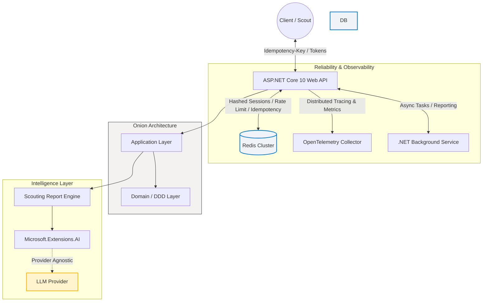

## Soccer Manager
 
A robust, scalable **.NET 10 Web API** for managing soccer teams and player transfers, built with **Onion Architecture** and **Domain-Driven Design (DDD)** principles. 

This enterprise-grade implementation prioritizes security and modern intelligence through:

* **Hardened Session Management**: Secure state handling using **Redis**, featuring hashed session IDs and encrypted tokens in transit.
  
* **At-Rest Data Protection**: Implementation of the **.NET Data Protection** system with AES encryption keys stored in the database, ensuring sensitive assets like **LLM API keys** remain encrypted at rest.

* **Distributed Rate Limiting**: Protection against API abuse across multiple instances using **Redis-backed rate limiting**, ensuring consistent throughput policies and global quota enforcement.
  
* **AI-Native Integration**: Seamlessly connected to intelligent services via **Microsoft.Extensions.AI** for unified, provider-agnostic Large Language Model (LLM) workflows.

* **Distributed Idempotency**: A custom **Redis-backed idempotency** using SHA-256 request hashing and distributed locking. This ensures 100% data integrity for **offline-first clients**, preventing duplicate resource creation during retry scenarios.

* **Background Processing**: Leverages .NET Background Services to offload intensive tasks (like AI report generation) from the request pipeline. This ensures near-instant response times for clients while complex operations continue reliably in the background.

* **Observability**: Instrumented with OpenTelemetry, providing distributed tracing, metrics, and structured logging across the API, Redis, and SQL Server for rapid root-cause analysis.


### 🚀 Technologies:

* **Runtime:** .NET 10 SDK

* **Architecture:** Onion Architecture / Clean Architecture

* **Patterns:** Domain-Driven Design (DDD), Repository Pattern, Unit of Work, Optimistic Concurrency

* **Database:** SQL Server via Entity Framework Core

* **Identity:** ASP.NET Core Identity API Endpoints (Cookie and Bearer Token auth)

* **Rate Limiting, Session Management, Idempotency, Distributed Caching:** Redis

* **Documentation:** Swagger, Scalar, OpenAPI	

### 🏗️ Architecture Overview

The project is divided into four concentric layers following Onion Architecture principles: 

* **Domain:** Core business logic, entities, value objects, and domain exceptions. No external dependencies.

* **Application:** Use cases, service interfaces, DTOs, and mapping logic.

* **Infrastructure:** Implementation of data access (SQL Server), Identity services, and external integrations.

* **Presentation (API):** Entry point, controllers, Identity API endpoint configuration, middlewares for unit of work and global exception handling, authorization etc.
  


### 🔑 Authentication & Authorization

This project uses the native .NET Identity API Endpoints for a streamlined auth experience:

* **POST** /auth/register: Create a new user account.

* **POST** /auth/login: Exchange credentials for a Bearer token.

* **POST** /auth/refresh: Renew expired sessions.

* **Auth Type:** Cookie (for web browsers) & JWT / Bearer Token (for native clients). 


### 📊 Observability & Monitoring

The system is fully instrumented using **OpenTelemetry (OTel)** to ensure high availability and performance:

* **Distributed Tracing**: Follows a request's lifecycle from the API through the Idempotency Filter, into the Service Layer, and down to SQL/Redis queries, including the hand-off to Background Services for asynchronous processing
* **Health Checks**: Real-time monitoring of SQL Server, Redis, and Background Job health.


### 🛠️ Getting Started

### Prerequisites

* .NET 10 SDK

* SQL Server (Express or LocalDB)

* Visual Studio 2022 (v17.12+)

* Redis

### Installation

1) **Clone the repository:**

   ```bash
   git clone <repository-url>
   cd your-project
   ```

2) **Configuration:**
  Update the settings in `appsettings.json` or use [User Secrets](https://learn.microsoft.com) for local development:

  * **SQL Server Database:** Update `DefaultConnection` to point to your SQL instance.

  * **Redis:** Update the `Redis` connection string (required for session management and distributed rate limiting).

  * **Data Protection:** Provide a Base64-encoded PFX certificate to encrypt keys at rest. You can find the PowerShell script for generating local test certificates in the scripts/ folder of this repository. To execute the generator, run these commands in your PowerShell terminal:

    ```powershell
    #  By default, Windows restricts running scripts. Allow script execution for the current session
    Set-ExecutionPolicy -ExecutionPolicy RemoteSigned -Scope Process 

    # Required: Provide a password (uses default name 'DataProtectionCert')
    .\GenerateDataProtectionCert.ps1 -Password "StrongPassword!"

    # Optional: Customize the name and duration
    .\GenerateDataProtectionCert.ps1 -Password "StrongPassword!" -CertName "ProdCert" -Days 365
    ```

  * **Observability (OpenTelemetry)**: The API is instrumented via standard environment variables. For local development, these are pre-configured in `launchSettings.json`, but can be overridden in your shell:
 
      **Bash (Linux/macOS/WSL):**

      ```bash
      export OTEL_SERVICE_NAME="SoccerManagers"
      export OTEL_EXPORTER_OTLP_ENDPOINT="http://127.0.0.1:4318"
      export OTEL_EXPORTER_OTLP_PROTOCOL="http/protobuf"
      ```

      **PowerShell (Windows):**
 
      ```powershell
      $env:OTEL_SERVICE_NAME="SoccerManager"
      $env:OTEL_EXPORTER_OTLP_ENDPOINT="http://127.0.0.1:4318"
      $env:OTEL_EXPORTER_OTLP_PROTOCOL="http/protobuf"
      dotnet run
     ```

  * **Admin Identity**: Set the default credentials for  the initial administrative account.

  
  * **Example `appsettings.json` structure:**

    ```json
    {
      "ConnectionStrings": {
          "DefaultConnection": "Server=YOUR_SERVER;Database=YOUR_DB;User Id=YOUR_USER;Password=YOUR_PASSWORD;TrustServerCertificate=True;",
          "Redis": "localhost:6379"
      },
      "AdminUser": {
          "Email": "admin@yourdomain.com",
          "UserName": "admin",
          "Password": "<Password>"
      },
      "RateLimitOptions": {
          "GlobalLimit": 500,
          "UserLimit": 100,
          "GuestLimit": 20
      },
      "DataProtectionOptions": {
          "CertOptions": [
           {
               "Base64": "<Base64>",
               "Password": "<Password>"
           }
          ],
          "_Note": "StorageFlag: Use EphemeralKeySet for Linux/Docker/Azure, MachineKeySet for Windows IIS."
          "StorageFlag": "EphemeralKeySet"
      }
    }
    ```

    **🔄 Zero-Downtime Certificate Rotation**
    To rotate certificates in a distributed environment without invalidating user sessions, follow this sequence:
    Add Secondary: Add the new certificate as the second item in the Certificates array. Deploy to all nodes.
    Swap Primary: Move the new certificate to the first position (Index 0). New keys will now be encrypted with this cert, while old keys remain readable via the secondary entry.
    Cleanup: After 90 days (default key lifetime), remove the old certificate from the array.

    > [!IMPORTANT]
    > **Why we don't swap Primary immediately:**
    > Making a new cert Primary straight away creates a "race condition." If Server A generates a new key with the new cert, but Server B hasn't updated yet, Server B will fail because it cannot decrypt the new key. Adding it as a secondary first "teaches" all nodes how to read the new cert before any node starts writing with it.

3) **Run Migrations:**

   ```bash
   dotnet ef database update --project src/EntityFrameworkCore --startup-project src/Api
   ```

4) **Launch the Application:**

   Run the project and navigate to /swagger or /scalar to test the Api endpoints. 

### 🧪 Testing

Run the following command to execute unit and integration tests across all layers.

```bash
dotnet test
```
